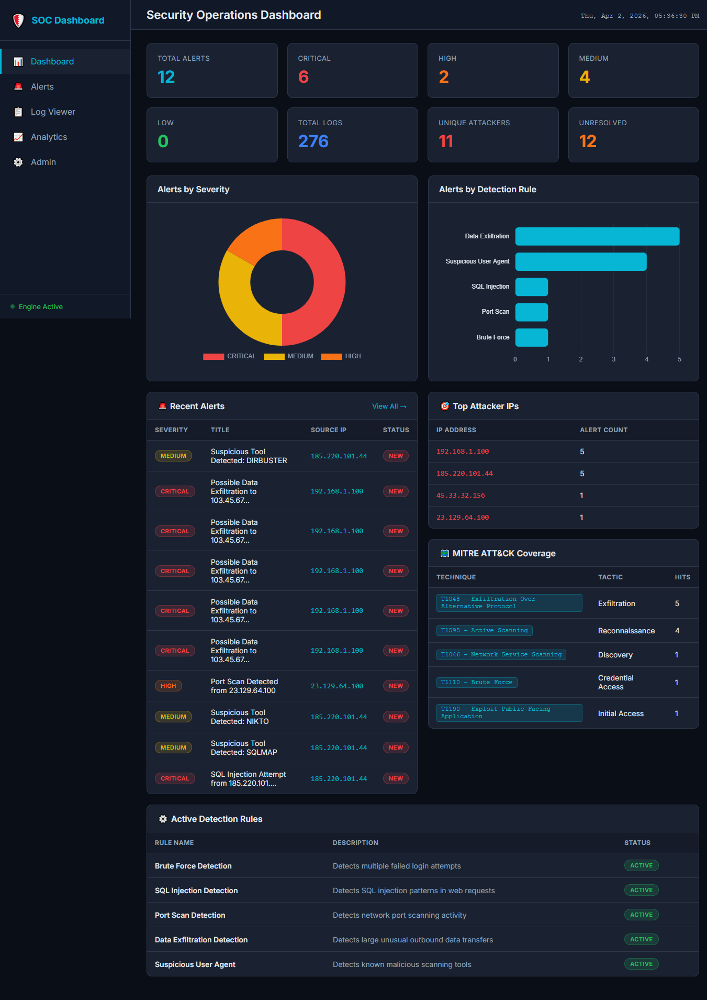
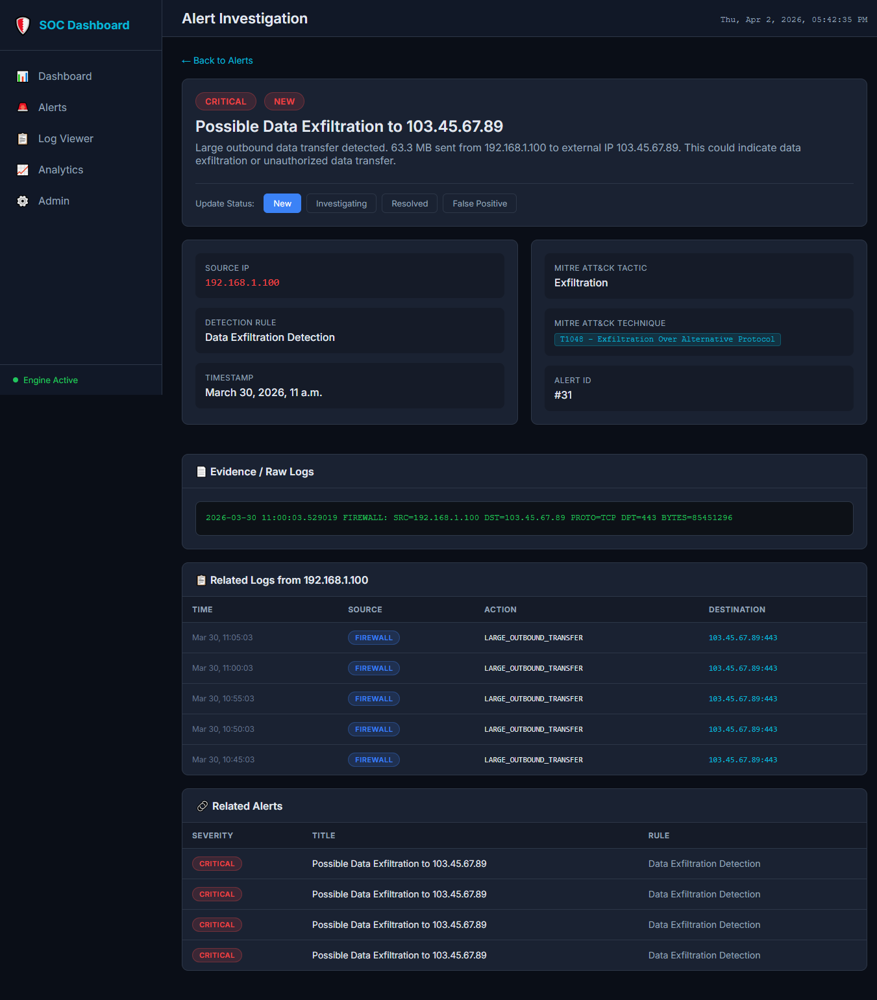
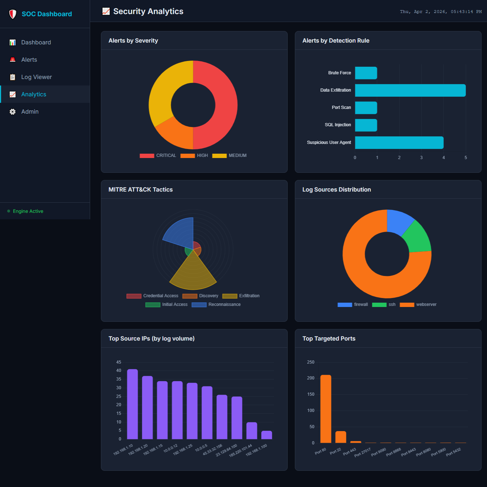
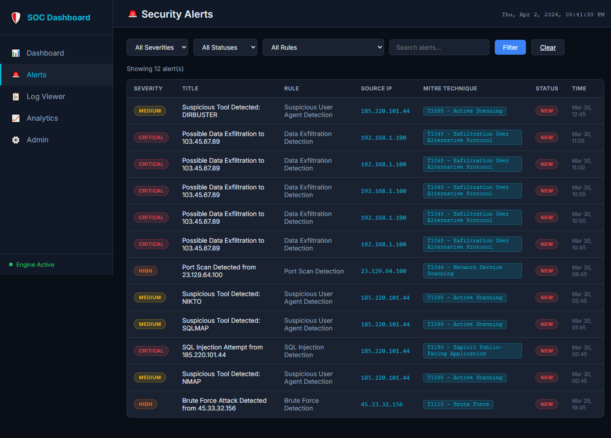
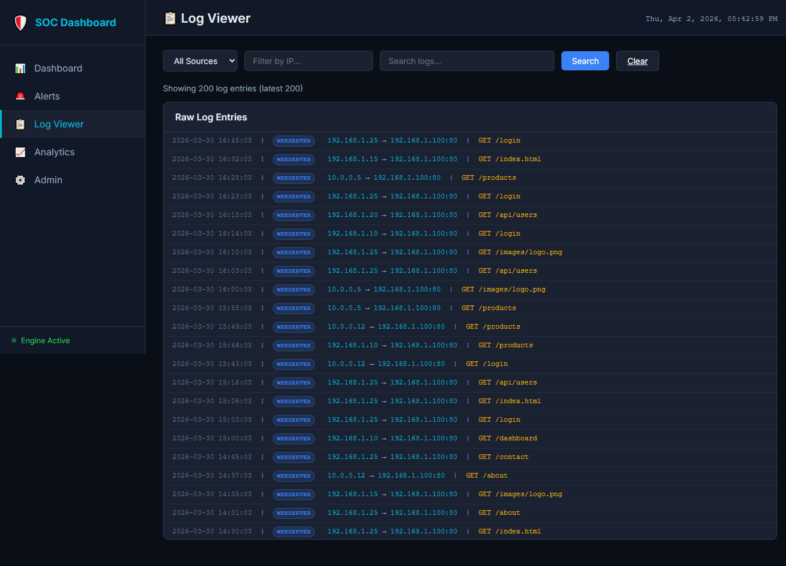

# 🛡️ SOC Automation Dashboard

A Security Operations Center (SOC) automation platform built with Python and Django that ingests security logs, applies custom threat detection rules, and displays real-time security analytics through a professional dashboard.

## 🎯 What This Project Does

This project simulates a real-world SOC environment:

1. **Ingests security logs** from multiple sources (web server, SSH, firewall, IDS)
2. **Runs 5 custom detection rules** to identify cyber attacks automatically
3. **Maps alerts to MITRE ATT&CK framework** for standardized threat classification
4. **Displays analytics** through an interactive dark-themed dashboard
5. **Sends alert notifications** via email or console

## 🚨 Detection Rules

| Rule | MITRE Technique | Severity | Description |
|------|----------------|----------|-------------|
| Brute Force Detection | T1110 - Brute Force | HIGH | Detects 5+ failed logins from same IP within 5 minutes |
| SQL Injection Detection | T1190 - Exploit Public-Facing App | CRITICAL | Detects SQLi patterns in web request parameters |
| Port Scan Detection | T1046 - Network Service Scanning | HIGH | Detects scanning of 10+ ports within 60 seconds |
| Data Exfiltration Detection | T1048 - Exfiltration Over Alt Protocol | CRITICAL | Flags outbound transfers exceeding 10MB to external IPs |
| Suspicious User Agent | T1595 - Active Scanning | MEDIUM | Identifies requests from known attack tools (sqlmap, nikto, nmap, etc.) |

## 📸 Screenshots

### Main Dashboard

*Real-time overview with severity breakdown, MITRE ATT&CK mapping, and attack analytics*

### Alert Investigation

*Detailed alert view with evidence logs, related activity, and status management*

### Security Analytics

*Six interactive charts covering severity distribution, MITRE tactics, top attackers, and targeted ports*

### Alert List with Filters

*Filterable alert list by severity, status, detection rule, and free-text search*

### Log Viewer

*Raw log viewer with source type, IP, and keyword filtering*

👤 Author:
Hassan Sadiq Khan

GitHub: @hassansadiqkhan8

Email: hassansadiqkhan8@gmail.com